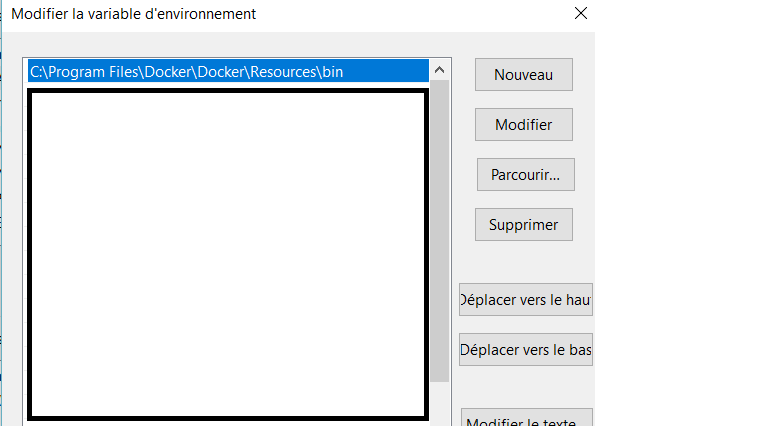

# Description and requirement
## Requirements
* Docker : https://store.docker.com/editions/community/docker-ce-desktop-windows
* Docker compose : https://docs.docker.com/compose/install/
* Java 8 : https://www.java.com/fr/
## Used techno
* Apache Flink : https://flink.apache.org/
* RabbitMQ : https://www.rabbitmq.com/
## Installation
* Launch docker
* docker-compose up -d _WITHIN APP DIRECTORY_ (to start rabbitMQ cluster)
* Wait while eveything is starting, after a while you should have a rabbitMQ cluster with 3 nodes and a local flink instance
* _http://localhost:15672_ for  rabbitMQ cluster management(login : guest,password : guest)
* Nodes on port _localhost:5672_,_localhost:5673_,_localhost:5674_
* docker run --name flink -p 8081:8081 -t flink local
* Flink manager on _http://localhost:8081_
* Everything is running. No need to do run section _UNLESS_ you have done installation part, stopped everything and now need to start your environnement
## Run :
* **_docker start rabbit-1 rabbit-2 rabbit-3 flink_local_**
* Wait for eveything to start
* Launch java main
## Known issues
* Docker, or docker-compose not detected as a command :
    * Check that docker is running
    * Check your path if there is (add it if not):
    

    
